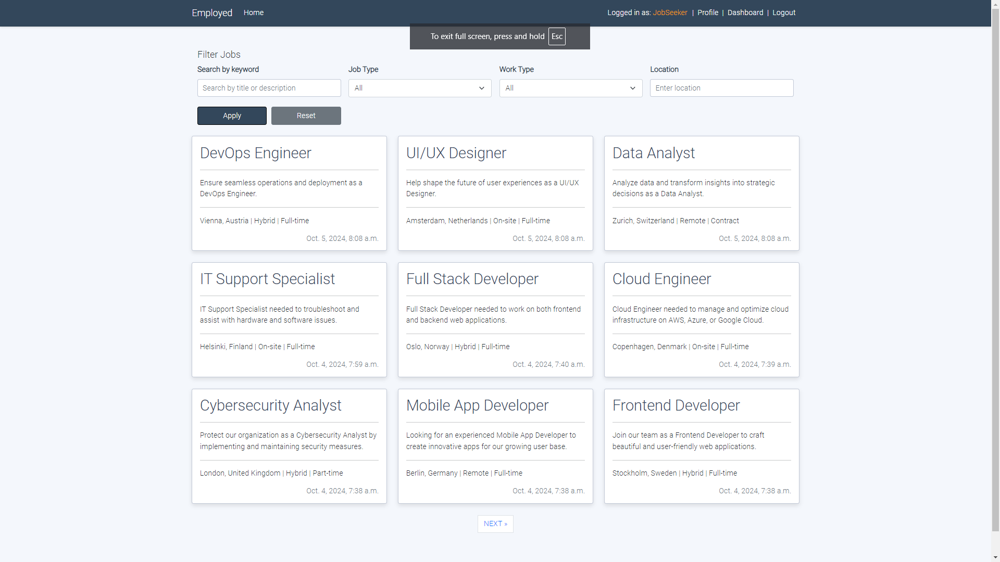

# Employed - Job Board

[View live project here!](https://employed-931f04b674fc.herokuapp.com/)

This project is a user-friendly **full-stack** web application that connects **job seekers** with potential **employers**.
Whether you're on the lookout for your next career move or looking to fill an open position, this platform has you covered.
**Job seekers** can easily **browse** through various job listings, **search** for opportunities that match their skills, and **submit** applications with just a few clicks.
On the flip side, **employers** can effortlessly **post** new job openings, **update** listings, and **manage** applications all in one place.
It’s designed to make the process of finding or posting jobs smooth, efficient, and accessible for everyone involved.

  
_Responsive design on various screen sizes_

---

## Table of Contents
- [Features](#features)
- [Screenshots](#screenshots)
- [Agile Methodology](#agile-methodology)
- [UX Design](#ux-design)
- [Database Schema](#database-schema)
- [Manual Testing](#manual-testing)
- [Automated Testing](#automated-testing)
- [Lighthouse Testing](#lighthouse-testing)
- [Validation and Browser Compatibility](#validation-and-browser-compatibility)
- [Version Control and Commits](#version-control-and-commits)
- [Security Considerations](#security-considerations)
- [Deployment](#deployment)
- [Technologies and Tools Used](#technologies-and-tools-used)
- [Cloning and Forking](#cloning-and-forking)
- [Credits](#credits)

---

## Features

### Existing Features
- **Employer Dashboard**: Employers can log in, post new jobs, and manage existing job listings (edit, close, or delete jobs).
- **Job Seeker Dashboard**: Job seekers can view the status of their applications and track progress, while job browsing and searching can be done on the main page.
- **Job Application Management**: Employers can view job applications, accept or reject them, and manage the status of applications.
- **Search and Filter**: Job seekers can filter jobs by type, work type, and location, as well as search by keywords in the job title, description, or excerpt.
- **Role-Based Authentication**: Employers and job seekers have different dashboard views and permissions based on their roles.
- **Closed Jobs**: Jobs that are closed are no longer open for applications, ensuring employers stop receiving applications when needed.
- **User Profile**: Implemented a user profile page where job seekers and employers can update their personal information (full name, email, phone, address, bio).
- **Prefill Application Form**: Job seekers can prefill the application form with their profile details to streamline the application process.

### Features to be Added
- **Notifications**: Implement notifications for employers when job applications are received and for job seekers when application status changes.
- **Job Alerts**: Allow job seekers to set alerts for new job postings that match their search criteria.
- **Employer Analytics**: Provide employers with analytics and insights about job postings (e.g., number of applications, views, etc.).
- **Favorite Jobs**: Allow job seekers to save jobs they’re interested in and revisit them later.
- **Email Verification**: Implement email verification during registration to ensure valid email addresses.
- **Profile Page Improvements**: Add the option for users to upload a profile picture, enhancing personalization and user experience.
- **CV and Cover Letter Upload**: Users will have the option to upload their CV or cover letter directly when applying for jobs.

---

## Screenshots

### Home Page

_The homepage provides users with easy navigation to browse available job listings._

### Job Seeker Dashboard

_Job seekers can view the status of their applications and track the progress of their job search._

### Employer Dashboard

_Employers can post and manage job listings as well as view applicant submissions._

### Job Details Page

_Job seekers can view detailed job descriptions and apply directly._

---

## Agile Methodology

This project followed an Agile development process, using **GitHub Projects** to manage the planning and tracking of user stories and tasks. The Kanban board was used to prioritize features and track progress.

You can access the Kanban board [here](https://github.com/users/Dimmanzo/projects/3).
- **Kanban Board**: The entire development process was managed using a Kanban board, ensuring that each task moved through the stages of "To Do", "In Progress", and "Done". 
  - **User Stories**: Each feature was mapped to a user story and broken down into smaller tasks.

_Kanban Board for Employed project_

---

## UX Design

During the design phase, wireframes were created to ensure the user interface would be intuitive, responsive, and easy to navigate.

- **Wireframes** were designed using **Balsamiq**.

_PC - Homepage, Mobile - Register wireframes_

---

## Database Schema

The data model for this project includes key entities such as users, profiles, jobs, and applications, all connected through foreign keys to create relationships between employers, job seekers, job listings, and applications.

- **Database schema** was designed using **dbdiagram.io**.

_Overview of all DB models_

- **Users**: This table stores core user information, including username, email, and password. 
- **Profiles**: This table extends the User model and stores additional information such as user roles (either "Employer" or "Job Seeker") and contact details (full name, phone number, address, and bio).
- **Jobs**: This table contains job postings created by employers. Each job includes details such as the title, description, location, job type (e.g., full-time, part-time), and work type (e.g., remote, on-site, hybrid). Each job is associated with an employer (via a foreign key reference to the users table).
- **Applications**: This table tracks job applications submitted by job seekers for specific jobs. It includes fields like the applicant's name, contact information, and a cover letter, as well as the application status (e.g., under review, accepted, rejected). Each application is linked to both a job and a user (the applicant).

---

## Manual Testing

Extensive manual testing was conducted to ensure proper functionality of all key features.

| Test Case | Expected Outcome | Result |
| --------- | ---------------- | ------ |
| Employer posts a job | Job appears on main job listings | ✅ |
| Job Seeker applies for job | Application successfully submitted | ✅ |
| Employer closes a job | No new applications accepted | ✅ |
| Job search | Relevant jobs displayed based on search query | ✅ |
| Filter jobs by type, work type, location | Only relevant jobs are displayed | ✅ |
| Employer edits job details | Job details are updated | ✅ |
| Role-based access | Employers cannot access job seeker-only features | ✅ |
| Admin can manage users and jobs from admin panel | Admin functionalities work correctly | ✅ |
| Job status change (Open/Closed) | Job status is updated correctly, closed jobs not accepting applications | ✅ |
| Prefill Application Form | Profile data (name, email, phone, address) is correctly prefilled | ✅ |
| User Profile Update | Users can successfully update their profile details (full name, email, phone, address, bio) | ✅ |
| Prevent login/register for authenticated users | Logged-in users are redirected from login/register pages to the dashboard | ✅ |

---

## Automated Testing

Automated testing has been implemented using Django’s built-in testing framework, including unit tests for views, models, and forms. The tests cover essential functionality across the Dashboard, Jobs, and Profiles apps.

- **Implemented Tests**:
  - Job creation, editing, and deletion workflows.
  - Job applications to ensure proper submission, acceptance, and rejection.
  - Authentication and role-based access (ensuring employers and job seekers have proper access rights).
  - Filtering and searching functionalities.

---

## Lighthouse Testing

The performance and accessibility of the website were tested using **Google Lighthouse**.

  
_Performance 97, Accessibility 100, Best Practices 100, SEO 100_

---

## Validation and Browser Compatibility

All HTML, CSS, and Python files were tested and validated with no errors found:

- **HTML Validator**: [W3C Markup Validation Service](https://validator.w3.org/)

  
_Tested on all pages with no errors found_

- **CSS Validator**: [W3C CSS Validation Service](https://jigsaw.w3.org/css-validator/)

  
_Tested with no errors found_

- **Python Linter**: [CI Python linter](https://pep8ci.herokuapp.com/) 

  
_Tested on all python files with no errors found_

### Browser Compatibility:
The project was tested across the following browsers to ensure compatibility:

- **Google Chrome**
- **Mozilla Firefox**
- **Microsoft Edge**

---

## Version Control and Commits

Version control was maintained using **Git** and **GitHub**. The commit history reflects small, frequent, and focused changes.

- **Commit Messages**: Each commit is meaningful and clearly describes the changes or feature implemented.
- **Commit Frequency**: Regular commits ensured that progress was consistently tracked.

---

## Security Considerations

Security features were a key focus of the development process to protect sensitive user information.

- **Environment Variables**: Sensitive information such as secret keys and database credentials are stored in environment variables.
- **Role-Based Authentication**: Access to features and content is restricted based on the user's role (employer or job seeker).
- **Password Security**: Django's built-in authentication and password hashing features are used to ensure secure login and account management.
- **Restricting Access**: Logged-in users are restricted from accessing the login and registration pages. They are automatically redirected to the dashboard when attempting to access these pages.

---

## Deployment

The project was deployed to Heroku using Git and GitHub for version control. The following steps were used to deploy the project:

1. Create a new Heroku app in the Heroku dashboard.
2. Set up **PostgreSQL from Code Institute** as the database.
3. Set up environment variables for sensitive data (SECRET_KEY, DATABASE_URL).
4. Push the project to Heroku using Git.
5. Migrate the database and create a superuser for admin access.

**Live Project**: [Deployed Site](https://employed-931f04b674fc.herokuapp.com/)

---

## Technologies and Tools Used

- **HTML**: For the structure of the website.
- **CSS**: For styling and layout.
- **JavaScript**: For interactivity and dynamic elements.
- **Django**: As the back-end framework for the project.
- **PostgreSQL**: The relational database used to store all project data.
- **Heroku**: Cloud platform used for deployment.
- **Git**: Version control system for tracking changes in the project.
- **GitHub Projects**: Project management tool for managing user stories and tasks.
- **Bootstrap**: CSS framework for responsive design and UI components.
- **Font Awesome**: Icon library used throughout the platform.
- **Balsamiq**: Wireframing tool used to create mockups for the project.
- **Gunicorn**: A WSGI HTTP Server used for running the Django application on Heroku.
- **Whitenoise**: A library for serving static files in Django, particularly in production (Heroku).
- **Django crispy forms**:  A Django package used to improve the layout and styling of forms.
- **Jinja**: Template engine that Django uses for rendering dynamic content into HTML.

---

## Cloning and Forking

### Cloning

To clone the repository:

- On GitHub.com, navigate to the main page of the repository.
- Above the list of files, click **Code**.
- Copy the URL for the repository.
- Type `git clone`, and then paste the URL you copied earlier.
- Press **Enter** to create your local clone.

### Forking

To fork the repository:

- On GitHub.com, navigate to the main page of the repository.
- In the top-right corner of the page, click **Fork**.
- Under "Owner," select the dropdown menu and click an owner for the forked repository.
- Click **Create Fork**.

---

## Credits

- **Code**: Help with Django best practices from the [Django documentation](https://docs.djangoproject.com/), Some ideas were taken from [Code Institute](https://codeinstitute.net/) - blog walktrough project.
- **Bootstrap**: Used for responsive grid layout and UI components such as buttons, forms, and navigation [Bootstrap documentation](https://getbootstrap.com/docs/5.3/getting-started/introduction/). 
- **Media**: Icons from [Font Awesome](https://fontawesome.com/).
- **Balsamiq**: For creating wireframes to visualize the design before development [Balsamiq](https://balsamiq.com/).
- **Google Fonts**: For typography styling used throughout the website [Google Fonts](https://fonts.google.com/).
- **Heroku**: For cloud deployment and hosting [Heroku](https://www.heroku.com/).
- **dbdiagram.io**: For database structure scheme [dbdiagram.io](https://dbdiagram.io/).
- **Flaticon**: Favicon taken from [Job seeker](https://www.flaticon.com/free-icon/job-seeker_5941749?term=employment&page=1&position=1&origin=tag&related_id=5941749).